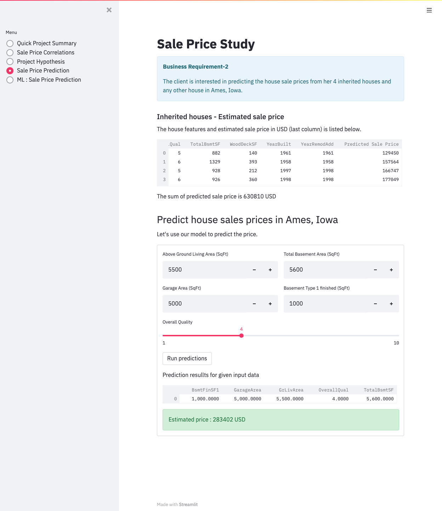
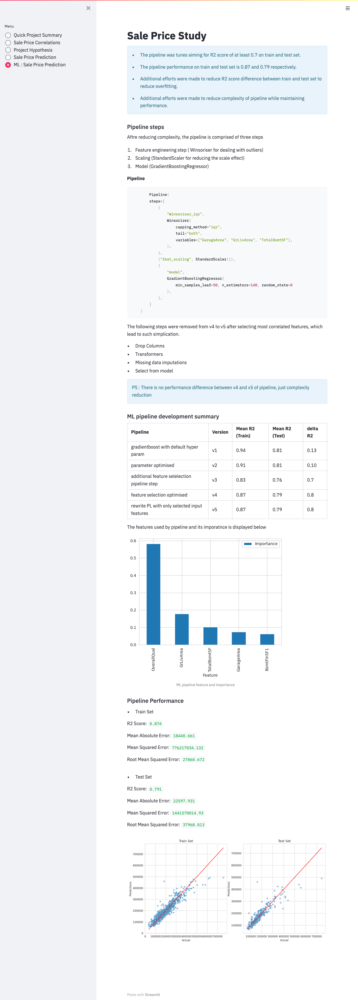

## Dataset Content

* The dataset is sourced from [Kaggle](https://www.kaggle.com/codeinstitute/housing-prices-data). We then created a fictitious user story where predictive analytics can be applied in a real project in the workplace.
* The dataset has almost 1.5 thousand rows and represents housing records from Ames, Iowa, indicating house profile (Floor Area, Basement, Garage, Kitchen, Lot, Porch, Wood Deck, Year Built) and its respective sale price for houses built between 1872 and 2010.

|Variable|Meaning|Units|
|:----|:----|:----|
|1stFlrSF|First Floor square feet|334 - 4692|
|2ndFlrSF|Second-floor square feet|0 - 2065|
|BedroomAbvGr|Bedrooms above grade (does NOT include basement bedrooms)|0 - 8|
|BsmtExposure|Refers to walkout or garden level walls|Gd: Good Exposure; Av: Average Exposure; Mn: Minimum Exposure; No: No Exposure; None: No Basement|
|BsmtFinType1|Rating of basement finished area|GLQ: Good Living Quarters; ALQ: Average Living Quarters; BLQ: Below Average Living Quarters; Rec: Average Rec Room; LwQ: Low Quality; Unf: Unfinshed; None: No Basement|
|BsmtFinSF1|Type 1 finished square feet|0 - 5644|
|BsmtUnfSF|Unfinished square feet of basement area|0 - 2336|
|TotalBsmtSF|Total square feet of basement area|0 - 6110|
|GarageArea|Size of garage in square feet|0 - 1418|
|GarageFinish|Interior finish of the garage|Fin: Finished; RFn: Rough Finished; Unf: Unfinished; None: No Garage|
|GarageYrBlt|Year garage was built|1900 - 2010|
|GrLivArea|Above grade (ground) living area square feet|334 - 5642|
|KitchenQual|Kitchen quality|Ex: Excellent; Gd: Good; TA: Typical/Average; Fa: Fair; Po: Poor|
|LotArea| Lot size in square feet|1300 - 215245|
|LotFrontage| Linear feet of street connected to property|21 - 313|
|MasVnrArea|Masonry veneer area in square feet|0 - 1600|
|EnclosedPorch|Enclosed porch area in square feet|0 - 286|
|OpenPorchSF|Open porch area in square feet|0 - 547|
|OverallCond|Rates the overall condition of the house|10: Very Excellent; 9: Excellent; 8: Very Good; 7: Good; 6: Above Average; 5: Average; 4: Below Average; 3: Fair; 2: Poor; 1: Very Poor|
|OverallQual|Rates the overall material and finish of the house|10: Very Excellent; 9: Excellent; 8: Very Good; 7: Good; 6: Above Average; 5: Average; 4: Below Average; 3: Fair; 2: Poor; 1: Very Poor|
|WoodDeckSF|Wood deck area in square feet|0 - 736|
|YearBuilt|Original construction date|1872 - 2010|
|YearRemodAdd|Remodel date (same as construction date if no remodelling or additions)|1950 - 2010|
|SalePrice|Sale Price|34900 - 755000|

## Business Requirements

The client has inherited four houses located in Ames, Iowa.The client wamts to maximise the sales price for the inherited properties.

The client fears that basing her estimates for property worth on her current knowledge (i.e. Belgian housing market) might lead to inaccurate appraisals. The client found a public dataset with house prices for Ames, Iowa, and it has been provided with the following objective.

* 1 - The client is interested in discovering how the house attributes correlate with the sale price. Therefore, the client expects data visualisations of the correlated variables against the sale price to show that.
* 2 - The client is interested in predicting the house sale price from her four inherited houses and any other house in Ames, Iowa.

## ? Hypothesis and how to validate?

* List here your project hypothesis(es) and how you envision validating it (them).

## The rationale to map the business requirements to the Data Visualisations and ML tasks

1. The client is interested in discovering how the house attributes correlate with the sale price. Therefore, the client expects data visualisations of the correlated variables against the sale price to show that.

2. The client is interested in predicting the house sale price from her four inherited houses and any other house in Ames, Iowa.

## ML Business Case

### Predict Sales Price

- Create an ML model to predict the sales price based on historical data that does not include the sales price. The target variable is numerical. 
- Consider a **regression model** to begin with. It is a supervised model with best possible combination of algorithm and tuned hyperparameters.
- Consider changing to classification task if necessary.
- The ideal outcome is to provide client with reliable insight into sales prices in the given neighbourhood and use that data to price inherited properties.
- The model success metrics are
	- at least 0.7 for R2 score, on train and test set 
	- The ML model is considered a failure if:
		-  after 12 months of usage, the model's predictions are 50% off more than 30% of the time. Say, a prediction is >50% off if predicted 1,000,000 months and the actual value was 200,000.
- The model output is defined as continuous value for Sales Price in USD. If the client talks to a salesperson, the client will interview to gather the input data and feed it into the App. Alternatively, since the client owns the property, she can collect data herself and feed into the App. The prediction is made on the fly (not in batches).
- Heuristics: Currently, the client does not have any approach to predict sales prices in given neighbourhood. The client knows how to predict sales prices in other regions, but feels uncomfortable to use this approach in given neighbourhood.
- The training data to fit the model comes from the public dataset. This dataset contains about 1.5 thousand records.
	- Train data - target: Sales Price; features: all other variables, but Sales Price??

## Dashboard Design (Streamlit App User Interface)

### Page 1: Quick Project Summary
- Project terms and jargon
- Describe project dataset
- State business requirements

### Page 2: Sales Price Study
- State business requirement 1
- Checkbox : data inspection on customer base (display the number of rows and cols in the data, and display first 10 rows)
- Display most correlated variables to sales price
- Conclusion
- Checkbox to further drill down on correlated variable with individual focus
- Checkbox to reveal parallel plot to understand correlated variables better

### Page 3: Sales Price Predictor
- State business requirement 2
- Show predicted price for four inherited houses
- Interactive widget input to house related features to predict sales prices for any given house in related area.

Final page design screenshot including all info 

### Page 4: Project Hypothesis and Validation
- The client did not present any hypothesis upfront, but after discussion the client informed us that she will expect higher price for properties with larger built up area. So, that formed the basis for our hypothesis.

- This hypothesis is Correct.

- Pearson correlation, which accounts for linear relation shows 0.6 to 0.7 score between sale price and
	- Above Ground Living Area (GrLivArea)
	- Total square feet of Basement Area (TotalBsmtSF)
	- 1st floor square feet (1stFlrSF)
	- Garage Area (GarageArea)
Additionally, ML algorithm with performance R2 score greater than 0.7 also idetified GrLivArea and Garage Area to be two of the top 5 parameters affecting sale price.

This evidence is statastically significant to say that the hypothesis is correct.

Final page design screenshot including all info 

### Page 5: ML Sales prediction
- Considerations and conclusions after pipeline is trained
- Present ML pipeline steps
- Feature importance
- Pipeline performance

Final page design screenshot including all info 

## Unfixed Bugs

* No known unfixed bugs present at the moment.

## Deployment

### Heroku

* The App live [link](https://pp5-house-price-prediction-17777932fd9f.herokuapp.com/).
* Set the runtime.txt Python version to a [Heroku-20](https://devcenter.heroku.com/articles/python-support#supported-runtimes) stack currently supported version.
* The project was deployed to Heroku using the following steps.

1. Log in to Heroku and create an App
2. At the Deploy tab, select GitHub as the deployment method.
3. Select your repository name and click Search. Once it is found, click Connect.
4. Select the branch you want to deploy, then click Deploy Branch.
5. The deployment process should happen smoothly if all deployment files are fully functional. Click the button Open App on the top of the page to access your App.
6. If the slug size is too large then add large files not required for the app to the .slugignore file.

## Main Data Analysis and Machine Learning Libraries

* Pandas : Primarily to read, write and save daframes
* Numpy : To generate random numbers
* Matplotlib and Seaborn : To generate plots
* pandas-profiling : generate industry standard profile report on variables
* ppscore : To fine correlations between variables
* feature-engine : for data cleaning, missing data imputation and transformers
* scikit learn : Cross validation and hyperparameter optmisiation.

## Credits

* The code to perform GridSearchCV, Custom Regression plots and Hyper parameter optmisations are taken from SciKit learn Notebook 9 and Walkthrough project.

* The outline of this documentation was taken from the accompanying (to the project) code repository provided by the Code Institute.

## Acknowledgements (optional)

* Big thank you to my mentor Mr Shami for pushing me and supporting me to complete my project.

